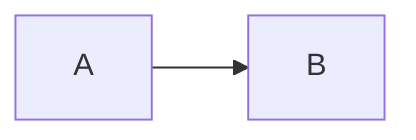



## 关键文件与目录位置

* 站点基础配置：`_config.yml`
* 顶部导航配置：`_data/navigation.yml`
* 独立页面：`_pages/`
* 内容集合（会自动生成归档页面）：
  * `_publications/`
  * `_portfolio/`
  * `_posts/`
  * `_teaching/`
  * `_talks/`
* 页脚模板：`_includes/footer.html`
* 静态资源（如 PDF）：`files/`
* 头像图片（可在 `_config.yml` 中指定）：`images/profile.png`

## 使用小贴士

* `.md` 文件会以 Markdown 渲染，`.html` 文件将按原样输出。
* 在仓库的 [提交记录](https://github.com/academicpages/academicpages.github.io/commits/master) 中，可以看到 GitHub 上次成功构建的版本：
  * 绿色对勾：构建成功
  * 橙色圆圈：构建进行中
  * 红色叉号：构建失败
  * 无图标：尚未构建
* Academic Pages 采用 [Jekyll Kramdown](https://jekyllrb.com/docs/configuration/markdown/) 解析器，语法与 GitHub Flavored Markdown 接近，表情符号可借助 [Jemoji](https://github.com/jekyll/jemoji) 插件。
* GitHub Pages 不支持服务端代码，但可使用前端脚本，例如集成 Google Analytics（详见[官方 Wiki](https://github.com/academicpages/academicpages.github.io/wiki/Adding-Google-Analytics)）。
* 简历既可以手写 Markdown（示例见 `/cv/`），也可以通过 JSON 生成（示例见 `/cv-json/`），记得在 `_data/navigation.yml` 中选择一种导航项。
* 想自定义功能时，可以查阅 [Liquid 语法指南](https://shopify.github.io/liquid/tags/control-flow/)。

## 数学公式（MathJax）

模板已内置 [MathJax 3](https://docs.mathjax.org/en/latest/) 支持，可直接书写 LaTeX 公式：

$$
\displaylines{
\nabla \cdot E= \frac{\rho}{\epsilon_0} \\
\nabla \cdot B=0 \\
\nabla \times E= -\partial_tB \\
\nabla \times B  = \mu_0 \left(J + \varepsilon_0 \partial_t E \right)
}
$$

常用定界符为 `$$...$$`、`\[...\]`（行间公式）以及 `\(...\)`（行内公式）。在引用字段等位置插入公式时，建议使用行内语法减少转义问题。

## 流程图（Mermaid）

使用三重反引号标记 `mermaid` 即可生成流程图或时序图：

```markdown
  ```mermaid
  graph LR
  A-->B
  ```
```

效果如下：



更多主题与示例请参考 [Mermaid 官方文档](https://mermaid.js.org/)。

## 交互可视化（Plotly）

只需在 Markdown 中插入 `plotly` 代码块并提供合法的 JSON，即可生成交互图表：

```markdown
    ```plotly
    {
      "data": [
        {
          "x": [1, 2, 3, 4],
          "y": [10, 15, 13, 17],
          "type": "scatter"
        },
        {
          "x": [1, 2, 3, 4],
          "y": [16, 5, 11, 9],
          "type": "scatter"
        }
      ]
    }
    ```
```

生成结果与主题保持一致。请注意所有 JSON 键都必须加引号，可借助 [JSONLint](https://jsonlint.com/) 校验格式。

```plotly
{
  "data": [
    {
      "x": [1, 2, 3, 4, 5],
      "y": [1, 6, 3, 6, 1],
      "mode": "markers",
      "type": "scatter",
      "name": "Team A",
      "text": ["A-1", "A-2", "A-3", "A-4", "A-5"],
      "marker": { "size": 12 }
    },
    {
      "x": [1.5, 2.5, 3.5, 4.5, 5.5],
      "y": [4, 1, 7, 1, 4],
      "mode": "markers",
      "type": "scatter",
      "name": "Team B",
      "text": ["B-a", "B-b", "B-c", "B-d", "B-e"],
      "marker": { "size": 12 }
    }
  ],
  "layout": {
    "xaxis": {
      "range": [0.75, 5.25]
    },
    "yaxis": {
      "range": [0, 8]
    },
    "title": {"text": "Data Labels Hover"}
  }
}
```

## Markdown 语法速览

Academic Pages 使用 [kramdown](https://kramdown.gettalong.org/index.html) 解析 Markdown，以下示例便于快速对照样式。

### 标题层级

```
# 一级标题
## 二级标题
### 三级标题
```

### 引用

> Markdown 可以轻松生成引用。

### 表格

| 项目 | 年份 | 说明 |
| ---- | ---- | ---- |
| 示例 A | 2016 | 列表中的示例说明 |
| 示例 B | 2019 | 列表中的示例说明 |
| 示例 C | 2022 | 列表中的示例说明 |

### 有序 / 无序列表

* 列表项一
  * 子项 a
  * 子项 b
* 列表项二

1. 步骤一
2. 步骤二
3. 步骤三

### 按钮与提示

给链接添加 `.btn` 类即可显示按钮样式。

```markdown
**请注意！** 可以在段落后添加 `{: .notice}` 显示提示框。
{: .notice}
```

### 脚注

```markdown
这是正文示例[^1]，脚注会自动排在文末。

[^1]: 这是脚注内容。
```

## HTML 标签支持

常见 HTML 标签可以直接内联使用，例如：

* `<address>` 显示地址信息：

  <address>
    1 Infinite Loop<br /> Cupertino, CA 95014<br /> United States
  </address>

* `<code>` 与 `<pre>` 用于展示代码：

```python
print('Hello World!')
```

* `<details>` 可创建折叠内容：

<details>
  <summary>点击展开</summary>
  这里是折叠内容示例。
</details>

希望本指南可以帮助你更快地本地化并管理本站内容。

